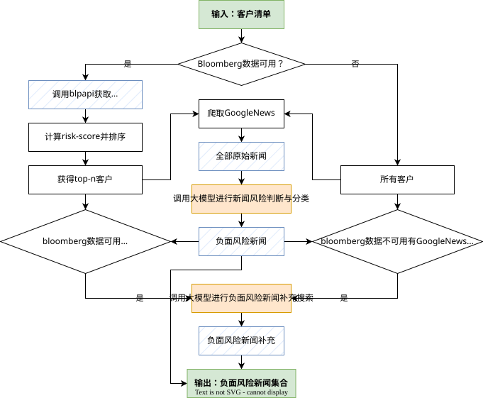

# Risk-Monitor 编程手册

本系统利用 **Bloomberg** 获取财务和新闻情绪指标，结合 **Google News** 检索公开新闻，借助 **Gemini** 进行风险识别与补充搜索，最终自动生成企业负面新闻监测报告。

## 1 项目概述

系统主要由四个核心模块构成：

1. **指标计算**：调用 Bloomberg API，提取财务指标、新闻情绪指标，并加权生成综合风险评分。
2. **新闻爬取**：调用 Google News 封装库 gnews 进行新闻爬取。
3. **新闻风险判断**：调用 Gemini API，对爬取的新闻进行风险判断与分类分析。
4. **新闻补充搜索**：调用 Gemini API 并使用 Google Search Tool，对负面风险新闻进行补充搜索。

系统流程图：


## 2 目录结构

```text
risk-monitor/
├── input/             					 # 输入文件
│   ├── company_list.xlsx        # 企业客户列表
│   └── index_mapping.xlsx		   # 行业指数映射
├── output/            					 # 输出结果
├── logs/              					 # 日志
├── src/
│   ├── main.py        					 # 主程序入口
│   ├── test.py 								 # 只进行新闻搜索的测试程序
│   ├── config.py      					 # 配置参数
│   ├── context.py     					 # 运行中的上下文数据结构
│   ├── metrics/       		 			 # Bloomberg 指标计算
│   │ 	├── bbg_client.py      	 # 连接和调用 Bloomberg API
│   │   ├── financial_metrics.py # 财务指标
│   │   └── news_metrics.py   	 # 新闻情绪指标
│   ├── spiders/       					 # Google News 新闻爬取
│   │   └── news_spider.py       # 连接和调用 gnews 库获取新闻 
│   ├── llm/           					 # 大语言模型相关模块
│   │   ├── api_key.py         	 # Gemini API Key 管理
│   │   ├── gemini.py            # 连接和调用 Gemini API
│   │   ├── llm_agent.py         # 使用 LLM 生成和解析文本
│   │   ├── news_classifier.py   # 新闻风险判断与分类
│   │   ├── news_searcher.py   	 # 负面风险新闻补充搜索
│   │   ├── prompts.py           # Prompt 加载
│   │   └── prompts/             # Prompt 模板文本内容
│   │       ├── news_classifier_v1.txt
│   │       └── news_searcher_v1.txt
│   └── utils/         					 # 通用工具函数
│			  ├── date_utils.py        # 日期处理与格式化
│       ├── excel_utils.py       # Excel 生成与格式设计
│       ├── logger.py            # 日志生成
│       ├── path_utils.py        # 路径生成与管理
│       └── pipeline_utils.py    # 上下文数据结构生成
├── .env
├── requirements.txt
└── README.md
```

## 3 环境准备与运行

- 环境要求

  - Python >= 3.11
  - Bloomberg Terminal


- 安装依赖

  ```bash 
  pip install -r requirements.txt
  ```

- 运行方法
  1. 连接互联网并登录Bloomberg Terminal。
  1. 在 `input/company_list.xlsx` 输入企业客户名单。
  1. 在 `src/config.py` 修改相关参数。
  1. 在 `.env` 配置 Gemini API Keys。
  1. 运行主程序 `src/main.py`。
  1. 等待程序运行结束，生成结果保存在 `output/`，运行日志保存在 `logs/`。


## 4 系统架构设计

### 4.1 Project Context

Project Context 是整个项目的核心数据对象，用于统一管理项目运行过程中所需的配置、输入数据、中间结果及最终输出。各业务模块通过共享同一个 `ProjectContext` 实例进行数据传递，而无需在模块之间传递大量参数，从而降低模块耦合，提高代码的可维护性和可扩展性。

#### 模块职责

- 保存项目分析时间范围。
- 管理所有输入、输出文件路径。
- 保存企业基础数据。
- 保存各阶段产生的中间结果。
- 为各业务模块提供统一的数据访问入口。

#### 数据结构

Project Context 主要由两个数据类组成。

##### FilePaths

`FilePaths` 用于统一管理项目中所有文件路径，包括输入文件及各模块输出结果。

| 属性             | 说明                       |
| ---------------- | -------------------------- |
| company_list     | 企业名单文件               |
| index_mapping    | 行业指数映射表             |
| output_dir       | 输出目录                   |
| financial_metric | 财务指标结果文件           |
| news_metric      | Bloomberg 新闻指标结果文件 |
| raw_news         | Google News 原始新闻       |
| risk_news        | LLM 风险分类结果           |
| llm_news         | LLM 新闻补充搜索结果       |
| report           | 最终风险报告               |

##### ProjectContext

`ProjectContext` 用于保存项目运行期间产生的所有数据对象，各模块均通过该对象读取输入数据并回写计算结果。

| 属性                | 说明                                   |
| ------------------- | -------------------------------------- |
| period              | 项目分析时间范围（`TimePeriod`类对象） |
| paths               | 项目文件路径（`FilePaths`类对象）      |
| bbg_companies_df    | Bloomberg 企业列表                     |
| nonbbg_companies_df | 非 Bloomberg 企业列表                  |
| financial_metric_df | 财务指标计算结果                       |
| news_metric_df      | 新闻指标计算结果                       |
| raw_news_df         | Google News 原始新闻                   |
| risk_news_df        | LLM 风险分类结果                       |
| llm_news_df         | LLM 新闻补充搜索结果                   |
| spider_company_df   | 需进行 Google News 爬取的企业列表      |
| search_company_df   | 需进行 LLM 新闻补充搜索的企业列表      |

#### 使用流程

项目启动时创建唯一的 `ProjectContext` 实例，并在整个执行过程中持续传递。各业务模块按照统一的数据流进行处理：

1. 从 `ProjectContext` 中读取所需数据；
2. 完成业务处理；
3. 将计算结果写回 `ProjectContext`；
4. 后续模块继续读取并处理。

这种设计使各模块仅关注自身业务逻辑，而无需关心数据来源及其他模块的实现细节，提高了系统的可维护性。

### 4.2 Config

Config 负责统一管理项目运行过程中使用的全局配置，包括运行开关、分析周期、大模型配置、Bloomberg 数据字段及 Prompt 配置等。所有业务模块均通过 `config.py` 获取配置项，避免在代码中使用硬编码，便于统一维护和调整。

项目配置主要包括以下几类：

#### 运行配置

用于控制项目是否执行特定功能模块。

| 配置项              | 说明                      |
| ------------------- | ------------------------- |
| RUN_NEWS_CLASSIFIER | 是否执行新闻风险分类模块  |
| RUN_LLM_NEWS_SEARCH | 是否执行 LLM 联网搜索模块 |

#### 分析周期配置

用于定义风险分析时间窗口及基准期。

| 配置项            | 说明                                                  |
| ----------------- | ----------------------------------------------------- |
| PERIODICITY       | 数据统计周期（支持DAILY / WEEKLY / MONTHLY / YEARLY） |
| ANALYSIS_LOOKBACK | 分析期长度                                            |
| BASELINE_LOOKBACK | 基准期长度                                            |

上述配置将用于生成 `TimePeriod`，供 Bloomberg 指标计算及新闻检索模块统一使用。

#### Gemini 配置

用于管理大语言模型相关参数。

| 配置项          | 说明                                              |
| --------------- | ------------------------------------------------- |
| GEMINI_MODELS   | 可用 Gemini 模型列表                              |
| GEMINI_API_KEYS | Gemini API Key 列表，自动读取 `.env` 中配置的信息 |

项目支持配置多个模型及多个 API Key，若当前模型或 API Key 不可用，系统会自动切换至备用配置，提高运行稳定性。

#### Prompt 配置

用于管理 LLM 所使用的 Prompt 模板文件。

| 配置项        | 说明                |
| ------------- | ------------------- |
| PROMPT_CONFIG | Prompt 文件映射关系 |

- `news_classifier`：新闻风险分类 Prompt；
- `news_searcher`：新闻补充搜索 Prompt。

Prompt 文件独立存放，便于后续优化 Prompt，而无需修改业务代码。

#### Bloomberg 配置

用于定义 Bloomberg 数据接口所需字段。

| 配置项           | 说明             |
| ---------------- | ---------------- |
| NEWS_FIELDS      | 新闻情绪指标字段 |
| FINANCIAL_FIELDS | 财务指标字段     |

- `NEWS_FIELDS` 用于 Bloomberg 新闻指标计算；
- `FINANCIAL_FIELDS` 用于获取企业及基准指数的财务数据。

通过统一维护字段列表，可方便新增或删除 Bloomberg 字段，而无需修改接口代码。

#### 其他配置

| 配置项 | 说明                                          |
| ------ | --------------------------------------------- |
| TOP_N  | 根据 Bloomberg 指标筛选需进一步分析的企业数量 |

该参数用于控制后续新闻抓取及风险分析的企业规模，可根据实际业务需求进行调整。

## 5 模块设计

### 5.1 Bloomberg Metrics

Bloomberg Metrics 模块负责与 Bloomberg Terminal 建立连接，获取项目所需的新闻情绪指标（News Metrics）和财务指标（Financial Metrics），并将原始数据转换为后续风险分析所需的标准化数据集。该模块封装了 Bloomberg API 的所有交互逻辑，上层业务无需直接调用 `blpapi`，只需调用 `run_news()` 或 `run_financial()` 即可完成数据获取、指标计算及结果导出。

#### 模块职责

- 建立并维护 Bloomberg Session。
- 获取 Historical Data（历史时间序列数据）。
- 获取 Reference Data（静态参考数据）。
- 调用指标计算模块完成新闻情绪指标及财务指标计算。
- 保存结果并导出。

#### Bloomberg 连接初始化

模块初始化时会创建 Bloomberg Session，并依次完成以下步骤：

1. 检查本地 8194 端口是否可连接；
2. 启动 Bloomberg Session；
3. 打开 `//blp/refdata` 服务。

若任一步骤失败，将直接抛出异常终止程序。

#### Bloomberg 数据获取

`get_historical_data()` 用于获取在给定时间范围内的历史数据。该接口主要供新闻情绪指标使用。

`get_reference_data()` 用于获取静态属性数据。该接口主要用于财务指标计算。

#### 新闻情绪指标计算流程（run_news）

1. 检查本地是否已有缓存结果，若存在则直接读取。
2. 分别获取分析期及基准期的新闻数据。
3. 调用 `calc_news_metrics()` 计算新闻指标。
4. 导出最终结果文件（`news_metrics.xlsx`）。

#### 新闻情绪评分计算

新闻情绪指标由 `calc_news_metrics()` 完成计算，通过分析期与基准期的新闻数据，对企业近期新闻风险进行量化评估，并生成综合风险评分 `RiskScore`。

主要计算流程如下：

##### 计算分析期指标

对分析期内的新闻数据进行获取，计算以下指标：

- `news_count`：新闻总数量；
- `neg_count`：负面新闻总数量（包含中英文新闻）；
- `neg_ratio`：负面新闻占全部新闻的比例；
- `sentiment`：新闻情绪值。

##### 计算基准期指标

将基准期数据按配置的统计周期（Daily / Weekly / Monthly / Yearly）进行分组，计算：

- `baseline_news_count`：平均每个周期的新闻数量；
- `baseline_neg_count`：平均每个周期的负面新闻数量。

##### 计算风险指标

将分析期与基准期进行比较，得到下列风险指标：

- **NegSpike**：负面新闻数量异常指数 NegSpike = `neg_count` ÷ `baseline_neg_count`
- **NegRatio**：负面新闻比例 NegRatio = `neg_ratio`
- **VolSpike**：新闻数量异常指数 VolSpike = `news_count` ÷ `baseline_news_count`
- **Sentiment**：新闻情绪值 Sentiment = `sentiment`

##### 计算综合风险评分

将四项指标进行归一化处理，并按照预设权重计算综合风险评分：

| 指标      | 权重 |
| --------- | ---- |
| NegSpike  | 40%  |
| NegRatio  | 30%  |
| VolSpike  | 20%  |
| Sentiment | 10%  |

最终生成的 `RiskScore` 用于对企业新闻风险进行排序，并作为后续新闻抓取及风险分析的重要依据。

#### 财务指标计算流程（run_financial）

1. 检查本地是否已有缓存结果，若存在则直接读取。
2. 读取行业-指数映射表（`index_mapping.xlsx`），根据国家与行业映射 Benchmark Index。
3. 分别获取分析企业及基准指数的财务数据。
4. 调用 `calc_financial_metrics()` 计算绝对/相对跌幅指标。
5. 导出最终结果文件（`financial_metrics.xlsx`）。

### 5.2 News Spider

News Spider 模块负责从 Google News 获取企业新闻，为后续 LLM 风险识别提供原始新闻数据。该模块封装了新闻爬取、新闻过滤及结果缓存等功能，上层业务仅需调用 `run()` 即可完成新闻抓取及结果导出。

#### 模块职责

- 初始化 GNews 爬虫实例。
- 根据企业名称获取相关新闻。
- 按分析时间范围过滤新闻。
- 保存原始新闻并导出。
- 支持缓存机制，避免重复爬取。

#### 新闻数据获取

`get_company_news()` 根据公司名称调用 GNews 接口获取相关新闻。

`get_news()` 负责遍历所有企业，依次执行新闻抓取，并完成以下处理：

- 根据企业名称查询相关新闻；
- 按分析时间范围过滤新闻；
- 提取新闻发布日期、标题、来源及链接等信息；
- 保留企业名称及 Bloomberg 标识等关联信息；
- 汇总所有企业新闻并生成统一 DataFrame。

为避免请求过于频繁，程序在每次新闻请求之间设置固定间隔（0.5 秒）。

#### 新闻抓取流程（run）

1. 检查本地是否已有缓存结果，若存在则直接读取。
2. 根据分析期配置初始化 GNews 爬虫。
3. 遍历企业列表，抓取所有相关新闻。
4. 根据分析时间范围过滤新闻。
5. 导出原始新闻结果文件（`raw_news.xlsx`）。

本模块仅负责新闻数据的采集与整理，生成的原始新闻数据将作为后续 LLM 风险分类模块的输入。

### 5.3 LLM Agent

LLM Agent 模块负责调用 Gemini API 完成新闻风险分析，是项目中所有大语言模型能力的统一入口。该模块封装了模型调用、API Key 管理、模型切换、异常重试及 Token 统计等功能，上层业务仅需调用 `generate()` 即可完成相关文本生成任务。

#### 模块职责

- 初始化 Gemini Client。
- 管理多个 Gemini 模型及 API Key。
- 支持 Google Search 工具调用。
- 自动重试临时异常请求。
- 自动切换模型及 API Key。
- 统计 Token 使用情况。

#### 大模型调用流程（generate）

1. 初始化当前 API Key 与默认模型。
2. 调用 Gemini API 生成结果。
3. 统计本次请求的 Token 使用情况。
4. 若发生临时异常，则自动重试。
5. 若当前模型不可用，则自动切换备用模型。
6. 若当前 API Key 不可用，则自动切换下一组 API Key。
7. 所有模型及 API Key 均失败后抛出异常。

该机制保证了在模型不可用、配额耗尽或网络波动等情况下，程序仍能够自动恢复并继续运行，提高整体稳定性。

#### 异常处理机制

模块根据异常类型采用不同的处理策略：

- 网络超时、连接失败、服务器错误（500/502/503/504）等临时异常，自动进行指数退避重试。
- API Key 无效、权限不足、配额耗尽（Quota Exceeded、429 等）时，自动切换至下一组 API Key。
- 当前模型调用失败时，自动切换至备用模型继续请求。
- 当所有模型及 API Key 均不可用时，记录错误日志并抛出最终异常。

此外，当 Gemini 返回空响应时，模块会主动识别并抛出 `EmptyResponseError`，避免将空结果继续传递给后续业务流程。

#### Token 使用统计

模块会自动统计各类业务的大模型资源消耗，包括：请求次数、消耗的token数量（包括prompt、output、thinking、tool）等。

统计结果按业务类型（如 `searcher`、`classifier`）分别记录，可用于后续成本分析、性能监控及 API 配额管理。

### 5.4 News Classifier

News Classifier 模块负责利用大语言模型对原始新闻进行风险识别与分类，是新闻分析流程的核心模块。该模块封装了 Prompt 构建、批量分类、结果整理及缓存导出等功能，上层业务仅需调用 `run()` 即可完成新闻风险识别。

#### 模块职责

- 构建新闻风险分类 Prompt。
- 批量调用 LLM 进行新闻分类。
- 提取风险类别、风险等级及分析原因。
- 保存分类结果并导出。

#### 新闻分类流程（run）

1. 检查本地是否已有分类结果，若存在则直接读取。
2. 根据新闻数量自动计算 Batch Size，并按批次调用 LLM 完成新闻分类。
3. 去除重复新闻并实时保存分类结果。
4. 按风险等级及发布日期排序。
5. 输出最终风险新闻结果文件（`risk_news.xlsx`）。

#### 批量处理机制

为了兼顾模型调用效率与 Token 消耗，模块根据新闻总数量动态计算 Batch Size。Batch Size 在设定的最小值与最大值之间自动调整，使整个分类过程控制在约定的调用次数内，从而降低 API 调用成本，同时减少单次请求过长导致的失败风险。

### 5.5 News Searcher

News Searcher 模块负责利用大语言模型结合 Google Search 检索企业风险新闻，用于补充 Google News 未覆盖或遗漏的重要风险事件。该模块封装了 Prompt 构建、联网搜索、批量处理及结果导出等功能，上层业务仅需调用 `run()` 即可完成企业风险新闻检索。

#### 模块职责

- 构建联网新闻检索 Prompt。
- 批量调用 LLM 进行新闻搜索。
- 利用 Google Search 获取企业风险新闻。
- 保存搜索结果并导出。

#### 新闻搜索流程（run）

1. 检查本地是否已有搜索结果，若存在则直接读取。
2. 根据已有结果过滤已检索企业，仅搜索未处理企业。
3. 按固定 Batch Size 分批调用 LLM 进行联网搜索。
4. 实时保存搜索结果，支持断点续跑。
5. 按风险等级及发布日期排序。
6. 输出最终搜索结果文件（`llm_news.xlsx`）。

#### 批量处理机制

为了平衡搜索效率与模型调用成本，模块采用固定 Batch Size 进行批量搜索。每次请求同时检索多个企业的相关新闻，可有效减少模型调用次数，提高整体检索效率。

此外，模块支持断点续跑机制。程序启动时会自动读取已有搜索结果，仅继续检索尚未完成的企业，避免重复调用 LLM，降低 Token 消耗，并减少因程序中断导致的重复搜索。

## 6 常见问题

### 6.1 Bloomberg 无法连接

**现象**

程序启动时报错：

```
Bloomberg unavailable. Please start and login to Bloomberg Terminal.
```

**原因**

- 互联网未连接
- Bloomberg Terminal 未启动
- Bloomberg 未登录

**解决方法**

连接互联网，启动 Bloomberg Terminal 并登录 Bloomberg 账户。

### 6.2 Gemini API 调用失败

**现象**

程序报错：

```
- Invalid API Key
- Quota Exceeded
- Resource Exhausted
```

**原因**

- API Key 配置错误
- API 配额耗尽
- 当前模型不可用

**解决方法**

1. 检查 `.env` 中的 `GEMINI_API_KEYS` 配置。
2. 确认 API Key 仍具有可用额度。
3. 增加备用 API Key。
4. 修改 `config.py ` 中的 `GEMINI_MODELS` 使用其他模型。

### 6.3 如何重新运行某一个模块

如果需重新执行某一个模块，删除对应输出文件后重新运行即可。

例如：

- 删除 `raw_news.xlsx`，重新抓取 Google News；
- 删除 `risk_news.xlsx`，重新进行新闻分类；
- 删除 `llm_news.xlsx`，重新进行新闻联网搜索；
- 删除 `news_metric.xlsx` 或 `financial_metric.xlsx`，重新获取 Bloomberg 数据。

其余模块仍会复用已有结果。

### 6.4 日志查看

程序运行日志保存在：`logs/`

日志包含：

- Bloomberg 数据获取情况
- Google News 抓取进度
- LLM 调用情况
- API Key 与模型切换记录
- Token 使用统计
- 异常及错误信息

出现运行异常时，应优先查看日志定位问题。
